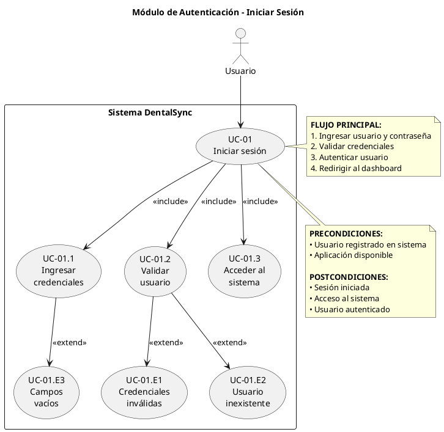
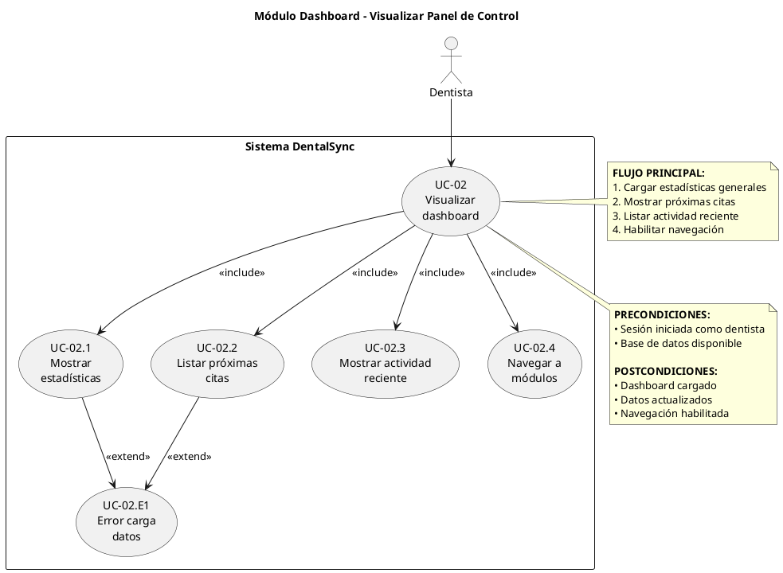
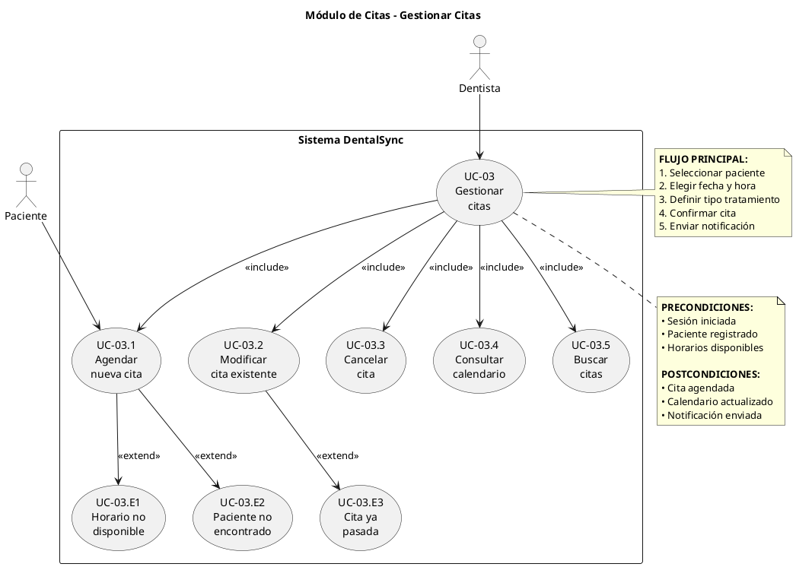
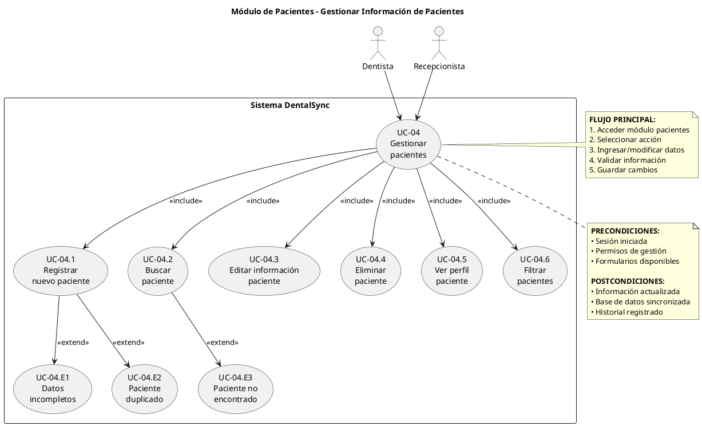
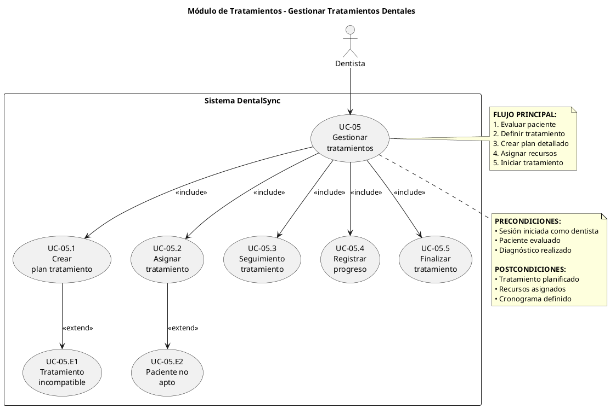
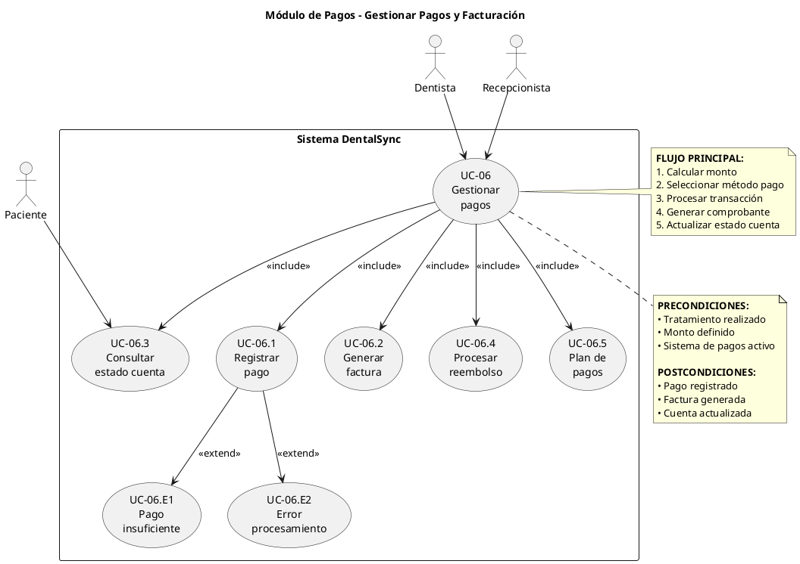
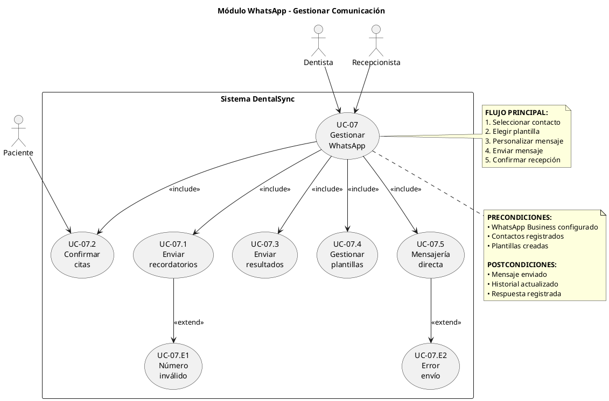
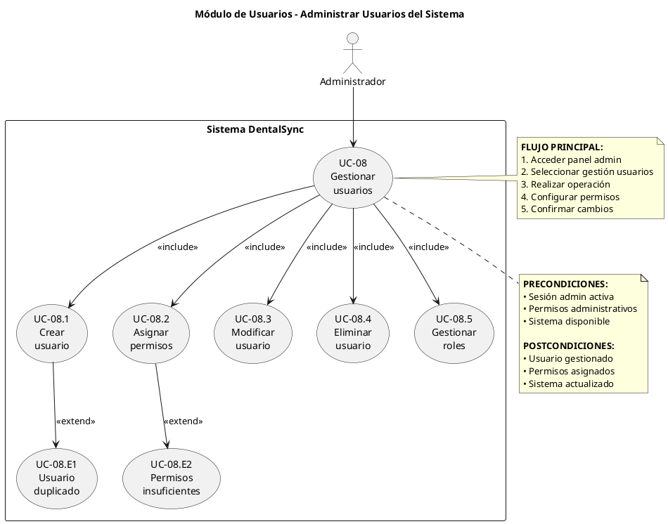
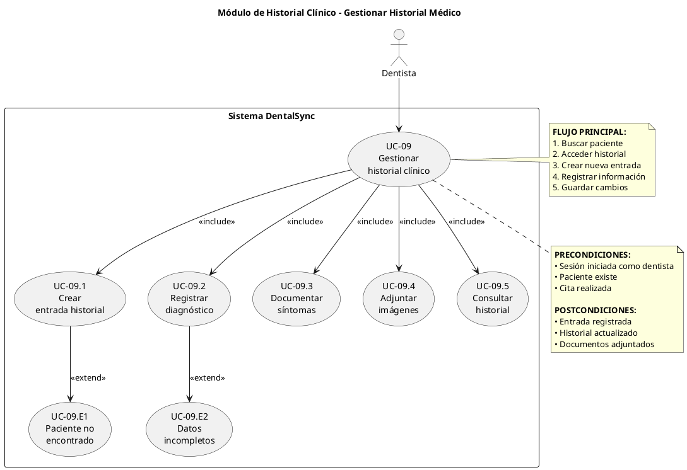
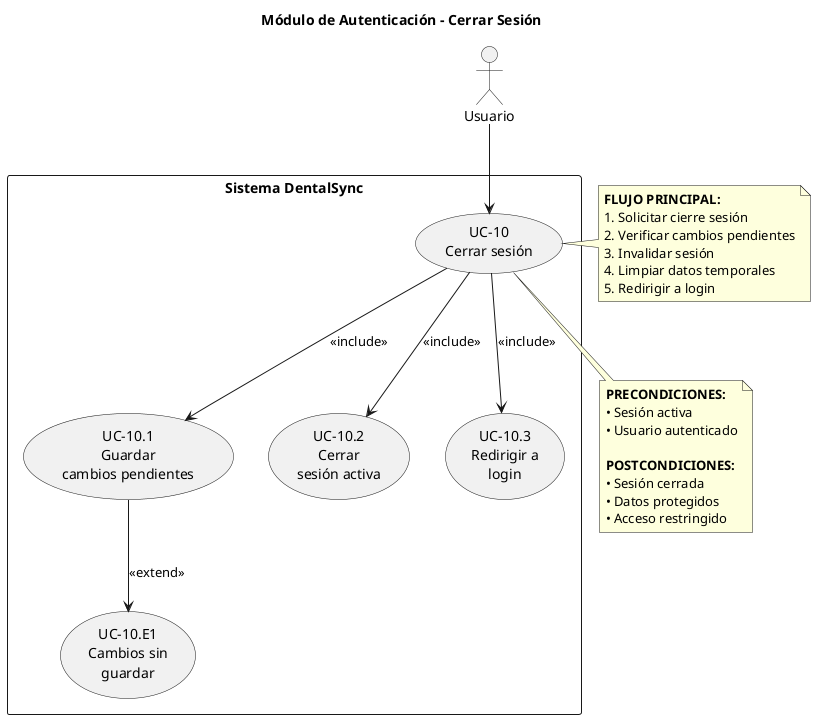

# Casos de Uso - Sistema DentalSync

## UC-01: Iniciar Sesión

## UC-02: Gestionar Dashboard

## UC-03: Gestionar Citas

## UC-04: Gestionar Pacientes

## UC-05: Gestionar Tratamientos

## UC-06: Gestionar Pagos

## UC-07: Comunicación WhatsApp

## UC-08: Gestionar Usuarios

## UC-09: Gestionar Historial Clínico

## UC-10: Cerrar Sesión

