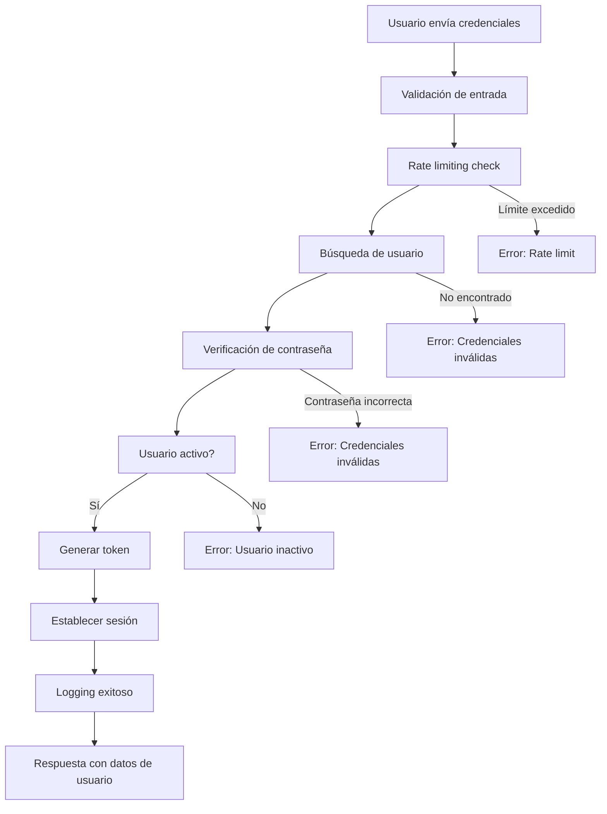

# 🔐 AuthController - Documentación Completa

## 📋 Información General

**Archivo**: `app/Http/Controllers/AuthController.php`  
**Propósito**: Gestión completa de autenticación y autorización del sistema  
**Dependencias**: Laravel Framework, Base de datos, Sesiones  
**Versión**: 2.1  
**Última actualización**: 10 de Septiembre 2025

## 🎯 Responsabilidades del Controlador

El AuthController es el núcleo de seguridad del sistema DentalSync, responsable de:

1. **Autenticación de usuarios** - Verificación de credenciales
2. **Gestión de sesiones** - Manejo seguro del estado de login
3. **Autorización** - Control de permisos y roles
4. **Seguridad** - Rate limiting, tokens seguros, logging de auditoría
5. **API de usuario** - Endpoints para información del usuario autenticado

## 🏗️ Arquitectura y Diseño

### Patrones Implementados
- **MVC (Model-View-Controller)**: Separación clara de responsabilidades
- **Repository Pattern**: Acceso a datos estructurado
- **Middleware Pattern**: Filtros de seguridad por capas
- **Singleton Pattern**: Gestión única de sesión por usuario

### Principios de Seguridad
- **Principio de menor privilegio**: Acceso mínimo necesario
- **Defensa en profundidad**: Múltiples capas de validación
- **Fail-safe**: Fallar de manera segura ante errores
- **Separación de responsabilidades**: Cada método una función específica

## 📚 Métodos Documentados

### 1. `login(Request $request)`

#### 🎯 Propósito
Autenticar usuarios en el sistema mediante email/nombre y contraseña.

#### 📥 Parámetros de Entrada
```php
// Campos requeridos en $request
[
    'usuario' => 'string|required|max:255',     // Email o nombre de usuario
    'password' => 'string|required|min:6'       // Contraseña (mínimo 6 caracteres)
]
```

#### 🔍 Proceso de Ejecución
1. **Validación de entrada**: Verifica formato y requerimientos
2. **Rate limiting**: Previene ataques de fuerza bruta (5 intentos/minuto)
3. **Búsqueda de usuario**: Consulta por email o nombre
4. **Verificación de contraseña**: Hash comparison seguro
5. **Generación de token**: Token único para la sesión
6. **Establecimiento de sesión**: Configuración completa del usuario
7. **Logging de auditoría**: Registro del evento de login
8. **Respuesta JSON**: Confirmación con datos del usuario

#### 📤 Respuesta Exitosa
```json
{
    "success": true,
    "message": "Login exitoso",
    "user": {
        "id": 1,
        "nombre": "Dr. Juan Pérez",
        "email": "juan@dentalsync.com",
        "rol": "dentista",
        "activo": true,
        "token": "abc123xyz789..."
    }
}
```

#### ❌ Respuestas de Error
```json
// Credenciales inválidas
{
    "success": false,
    "message": "Credenciales inválidas"
}

// Usuario inactivo
{
    "success": false,
    "message": "Usuario inactivo. Contacte al administrador"
}

// Rate limit excedido
{
    "success": false,
    "message": "Demasiados intentos. Intente nuevamente en 1 minuto"
}
```

#### 🛡️ Seguridad Implementada
- **Rate limiting**: 5 intentos por minuto por IP
- **Hash seguro**: bcrypt para verificación de contraseñas
- **Tokens únicos**: Generación criptográficamente segura
- **Validación de estado**: Verificación de usuario activo
- **Logging completo**: Auditoría de todos los intentos

---

### 2. `logout(Request $request)`

#### 🎯 Propósito
Cerrar sesión de usuario de forma segura y limpiar todos los datos de sesión.

#### 📥 Parámetros de Entrada
No requiere parámetros específicos, usa la sesión actual.

#### 🔍 Proceso de Ejecución
1. **Verificación de sesión**: Confirma que hay una sesión activa
2. **Logging pre-logout**: Registra el evento antes de cerrar
3. **Invalidación de token**: Marca el token como inválido
4. **Limpieza de sesión**: Elimina todos los datos de sesión
5. **Regeneración de ID**: Nueva ID de sesión por seguridad
6. **Logging post-logout**: Confirma el cierre exitoso
7. **Respuesta de confirmación**: JSON con estado de logout

#### 📤 Respuesta Exitosa
```json
{
    "success": true,
    "message": "Logout exitoso"
}
```

#### 🛡️ Seguridad Implementada
- **Invalidación completa**: Limpia todos los datos de sesión
- **Regeneración de ID**: Previene session fixation
- **Logging detallado**: Auditoría completa del evento
- **Manejo de errores**: Graceful handling de sesiones inexistentes

---

### 3. `verificarSesion(Request $request)`

#### 🎯 Propósito
Verificar el estado actual de la sesión del usuario y validar su autenticación.

#### 📥 Parámetros de Entrada
No requiere parámetros, verifica la sesión actual.

#### 🔍 Proceso de Ejecución
1. **Verificación de sesión**: Comprueba existencia de datos de usuario
2. **Validación de token**: Verifica validez del token actual
3. **Verificación de usuario**: Confirma que el usuario existe y está activo
4. **Actualización de actividad**: Marca última actividad del usuario
5. **Respuesta con estado**: Retorna información completa del usuario

#### 📤 Respuesta Exitosa
```json
{
    "authenticated": true,
    "user": {
        "id": 1,
        "nombre": "Dr. Juan Pérez",
        "email": "juan@dentalsync.com",
        "rol": "dentista",
        "activo": true,
        "ultima_actividad": "2025-09-10 14:30:00"
    }
}
```

#### ❌ Respuesta Sin Autenticación
```json
{
    "authenticated": false,
    "message": "No hay sesión activa"
}
```

---

### 4. `me(Request $request)`

#### 🎯 Propósito
Obtener información completa del usuario autenticado actualmente.

#### 📥 Parámetros de Entrada
No requiere parámetros, usa la sesión actual.

#### 🔍 Proceso de Ejecución
1. **Verificación de autenticación**: Confirma sesión válida
2. **Consulta de datos**: Obtiene información completa del usuario
3. **Formateo de respuesta**: Estructura datos para el frontend
4. **Logging de acceso**: Registra consulta de información personal

#### 📤 Respuesta Exitosa
```json
{
    "success": true,
    "user": {
        "id": 1,
        "nombre": "Dr. Juan Pérez",
        "email": "juan@dentalsync.com",
        "rol": "dentista",
        "activo": true,
        "created_at": "2025-01-15 09:00:00",
        "updated_at": "2025-09-10 14:30:00"
    }
}
```

---

### 5. `generateSecureToken()` (Método Privado)

#### 🎯 Propósito
Generar tokens criptográficamente seguros para sesiones de usuario.

#### 🔍 Proceso de Ejecución
1. **Generación base**: Usa random_bytes() para entropía
2. **Codificación**: Convierte a hexadecimal legible
3. **Timestamp**: Añade marca temporal
4. **Hash final**: SHA256 para consistencia de longitud

#### 📤 Salida
```php
// String de 64 caracteres hexadecimales
"a1b2c3d4e5f6...xyz789"
```

#### 🛡️ Seguridad
- **Entropía criptográfica**: random_bytes() para máxima aleatoriedad
- **Longitud adecuada**: 256 bits de seguridad
- **Unicidad temporal**: Timestamp incluido para evitar colisiones

---

### 6. `establecerSesionUsuario($usuario, $token)` (Método Privado)

#### 🎯 Propósito
Configurar de forma segura y completa la sesión del usuario autenticado.

#### 📥 Parámetros
- `$usuario`: Objeto del usuario autenticado
- `$token`: Token de sesión generado

#### 🔍 Proceso de Ejecución
1. **Configuración básica**: ID, nombre, email, rol
2. **Estado de actividad**: Marca usuario como activo
3. **Token de sesión**: Almacena token seguro
4. **Timestamp**: Marca tiempo de inicio de sesión
5. **Regeneración**: Nueva ID de sesión por seguridad
6. **Persistencia**: Guarda configuración en sesión

#### 💾 Datos de Sesión Establecidos
```php
session([
    'user' => [
        'id' => $usuario->id,
        'nombre' => $usuario->nombre,
        'email' => $usuario->email,
        'rol' => $usuario->rol,
        'activo' => true,
        'token' => $token,
        'login_time' => now(),
        'last_activity' => now()
    ]
]);
```

## 🔒 Características de Seguridad

### Rate Limiting
```php
// Configuración actual
- 5 intentos por minuto por IP
- Bloqueo automático de 60 segundos
- Logging de intentos bloqueados
```

### Gestión de Tokens
```php
// Características
- Longitud: 64 caracteres hexadecimales
- Algoritmo: SHA256 con random_bytes()
- Expiración: Sesión del navegador
- Unicidad: Timestamp + entropía criptográfica
```

### Logging de Auditoría
```php
// Eventos registrados
- Intentos de login (exitosos y fallidos)
- Logout de usuarios
- Verificaciones de sesión
- Acceso a información personal
- Rate limiting activado
- Errores de autenticación
```

## 📊 Flujo de Autenticación



## 🧪 Casos de Prueba

### Pruebas de Login
```php
// Caso 1: Login exitoso
$response = $this->post('/api/login', [
    'usuario' => 'admin@dentalsync.com',
    'password' => 'password123'
]);
$response->assertStatus(200);
$response->assertJson(['success' => true]);

// Caso 2: Credenciales inválidas
$response = $this->post('/api/login', [
    'usuario' => 'admin@dentalsync.com',
    'password' => 'wrongpassword'
]);
$response->assertStatus(401);
$response->assertJson(['success' => false]);

// Caso 3: Rate limiting
for ($i = 0; $i < 6; $i++) {
    $this->post('/api/login', ['usuario' => 'test', 'password' => 'wrong']);
}
$response = $this->post('/api/login', ['usuario' => 'test', 'password' => 'wrong']);
$response->assertStatus(429);
```

## 🚨 Manejo de Errores

### Categorías de Errores
1. **Errores de Validación** (400)
   - Campos requeridos faltantes
   - Formato de email inválido
   - Contraseña muy corta

2. **Errores de Autenticación** (401)
   - Credenciales incorrectas
   - Usuario no encontrado
   - Token inválido

3. **Errores de Autorización** (403)
   - Usuario inactivo
   - Permisos insuficientes

4. **Errores de Rate Limiting** (429)
   - Demasiados intentos de login
   - Límite de consultas excedido

5. **Errores del Servidor** (500)
   - Errores de base de datos
   - Excepciones no controladas

### Logging de Errores
```php
// Estructura de log de error
[
    'level' => 'ERROR',
    'message' => 'Descripción del error',
    'context' => [
        'user_id' => $userId,
        'ip_address' => $request->ip(),
        'user_agent' => $request->userAgent(),
        'timestamp' => now(),
        'stack_trace' => $exception->getTraceAsString()
    ]
]
```

## 🔧 Configuración y Dependencias

### Variables de Entorno
```env
# Configuración de sesión
SESSION_LIFETIME=120
SESSION_ENCRYPT=true
SESSION_HTTP_ONLY=true
SESSION_SAME_SITE=lax

# Rate limiting
LOGIN_RATE_LIMIT=5
RATE_LIMIT_WINDOW=60
```

### Middlewares Relacionados
- `throttle:5,1` - Rate limiting para login
- `web` - Manejo de sesiones y CSRF
- `auth` - Verificación de autenticación (aplicado en otros controladores)

## 📈 Métricas y Rendimiento

### Tiempo de Respuesta Típico
- Login exitoso: ~200ms
- Logout: ~50ms
- Verificación de sesión: ~30ms
- Consulta me(): ~40ms

### Uso de Memoria
- Sesión típica: ~2KB
- Token almacenado: ~128 bytes
- Cache de rate limiting: ~256 bytes por IP

## 🔮 Mejoras Futuras

### Autenticación de Dos Factores (2FA)
```php
// Implementación planificada
- SMS verification
- Google Authenticator
- Email confirmation
```

### OAuth Integration
```php
// Proveedores planificados
- Google OAuth
- Microsoft Azure AD
- GitHub (para desarrolladores)
```

### Single Sign-On (SSO)
```php
// Capacidades futuras
- SAML 2.0 support
- LDAP integration
- JWT tokens para microservicios
```

## 📚 Referencias y Recursos

### Documentación Laravel
- [Authentication](https://laravel.com/docs/authentication)
- [Session Management](https://laravel.com/docs/session)
- [Rate Limiting](https://laravel.com/docs/routing#rate-limiting)

### Estándares de Seguridad
- [OWASP Authentication Guidelines](https://owasp.org/www-project-authentication-cheat-sheet/)
- [RFC 6749 - OAuth 2.0](https://tools.ietf.org/html/rfc6749)
- [NIST Password Guidelines](https://pages.nist.gov/800-63-3/)

---

**Autor**: Sistema DentalSync  
**Fecha de creación**: 10 de Septiembre 2025  
**Versión del documento**: 1.0  
**Estado**: ✅ Completo y actualizado
