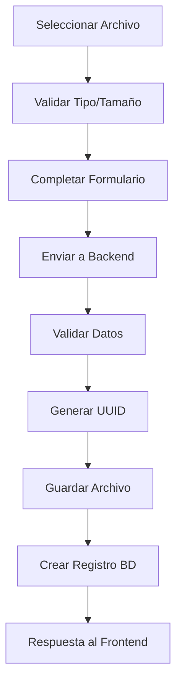
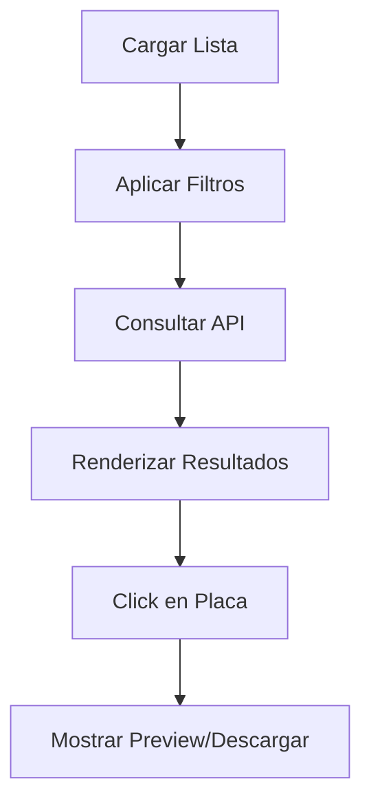

# 📋 Módulo de Placas Dentales - Documentación Técnica

## 🎯 Descripción General
El módulo de **Placas Dentales** permite a los dentistas gestionar de forma completa las radiografías y placas dentales de sus pacientes, incluyendo subida, visualización, categorización y almacenamiento seguro de archivos.

---

## 🛠️ Arquitectura del Sistema

### Backend (Laravel)
- **Controlador**: `PlacaController.php`
- **Modelo**: `PlacaDental.php`
- **Migración**: `2025_07_22_190318_create_placas_dentales_table.php`
- **Rutas API**: `/api/placas/*`

### Frontend (Vue.js)
- **Componente Principal**: `PlacaSubir.vue`
- **Componente Visualización**: `PlacaVer.vue`
- **Componente Eliminación**: `PlacaEliminar.vue`
- **Rutas**: `/placas/subir`, `/placas/ver`, `/placas/eliminar`

---

## 📊 Estructura de Base de Datos

### Tabla: `placas_dentales`
```sql
CREATE TABLE placas_dentales (
    id BIGINT UNSIGNED AUTO_INCREMENT PRIMARY KEY,
    fecha DATE NOT NULL,
    lugar VARCHAR(255) NOT NULL,
    tipo VARCHAR(100) NOT NULL,
    archivo_url VARCHAR(500) NULL,
    paciente_id BIGINT UNSIGNED NOT NULL,
    created_at TIMESTAMP NULL,
    updated_at TIMESTAMP NULL,
    
    FOREIGN KEY (paciente_id) REFERENCES pacientes(id) ON DELETE CASCADE
);
```

### Campos Principales
- **fecha**: Fecha de toma de la placa
- **lugar**: Ubicación donde se tomó la placa
- **tipo**: Tipo de placa (panorámica, periapical, bitewing, lateral, oclusal)
- **archivo_url**: Ruta del archivo almacenado
- **paciente_id**: Relación con el paciente

---

## 🔧 API Endpoints

### 📤 Subir Placa Dental
```http
POST /api/placas
Content-Type: multipart/form-data

{
    "paciente_id": "integer|required",
    "fecha": "date|required",
    "lugar": "string|required|max:255",
    "tipo": "string|required|in:panoramica,periapical,bitewing,lateral,oclusal",
    "archivo": "file|required|mimes:jpg,jpeg,png,pdf|max:10240"
}
```

**Respuesta Exitosa (201)**:
```json
{
    "success": true,
    "message": "Placa dental subida correctamente",
    "placa": {
        "id": 1,
        "fecha": "2025-07-27",
        "lugar": "Clínica Dental XYZ",
        "tipo": "panoramica",
        "paciente_id": 5,
        "paciente_nombre": "Juan Pérez",
        "archivo_url": "http://localhost/storage/placas_dentales/uuid-filename.jpg",
        "created_at": "2025-07-27T10:30:00.000000Z"
    }
}
```

### 📋 Listar Placas
```http
GET /api/placas?paciente_id=5&tipo=panoramica&fecha_desde=2025-01-01
```

**Respuesta**:
```json
[
    {
        "id": 1,
        "fecha": "2025-07-27",
        "lugar": "Clínica Dental XYZ",
        "tipo": "panoramica",
        "paciente_id": 5,
        "paciente_nombre": "Juan Pérez",
        "archivo_url": "http://localhost/storage/placas_dentales/uuid-filename.jpg",
        "created_at": "2025-07-27T10:30:00.000000Z",
        "updated_at": "2025-07-27T10:30:00.000000Z"
    }
]
```

### 🔍 Ver Placa Específica
```http
GET /api/placas/{id}
```

### ✏️ Actualizar Placa
```http
PUT /api/placas/{id}
Content-Type: application/json

{
    "fecha": "2025-07-28",
    "lugar": "Nueva ubicación",
    "tipo": "periapical"
}
```

### 🗑️ Eliminar Placa
```http
DELETE /api/placas/{id}
```

---

## 🎨 Componentes Frontend

### 1. PlacaSubir.vue
**Funcionalidades**:
- Formulario de subida con validación
- Preview de archivos antes de subir
- Selector de paciente con búsqueda
- Validación de tipos de archivo
- Indicador de progreso de subida

**Características técnicas**:
- Utiliza `FormData` para envío multipart
- Validación client-side y server-side
- Manejo de errores con mensajes específicos
- Integración con axios para HTTP requests

### 2. PlacaVer.vue
**Funcionalidades**:
- Lista paginada de placas
- Filtros por paciente, tipo y fecha
- Vista previa de imágenes
- Descarga de archivos PDF
- Información detallada de cada placa

### 3. PlacaEliminar.vue
**Funcionalidades**:
- Confirmación antes de eliminar
- Eliminación tanto del registro como del archivo físico
- Feedback visual del proceso

---

## 📁 Gestión de Archivos

### Ubicación de Almacenamiento
```
storage/app/public/placas_dentales/
```

### Configuración de Storage
- **Disk**: `public`
- **Acceso**: Mediante symlink desde `public/storage`
- **Naming**: UUID único + extensión original
- **Tamaño máximo**: 10MB por archivo

### Tipos de Archivo Soportados
- **Imágenes**: JPG, JPEG, PNG
- **Documentos**: PDF
- **Validación**: MIME type y extensión

---

## 🔒 Seguridad y Validación

### Validaciones Backend
```php
$request->validate([
    'paciente_id' => 'required|exists:pacientes,id',
    'fecha' => 'required|date',
    'lugar' => 'required|string|max:255',
    'tipo' => 'required|in:panoramica,periapical,bitewing,lateral,oclusal',
    'archivo' => 'required|file|mimes:jpg,jpeg,png,pdf|max:10240'
]);
```

### Validaciones Frontend
- Verificación de tipo de archivo antes del envío
- Límite de tamaño de archivo
- Campos requeridos con feedback visual
- Validación de formato de fecha

### Medidas de Seguridad
- Generación de nombres únicos con UUID
- Validación de MIME types
- Restricción de extensiones permitidas
- Relación obligatoria con paciente existente

---

## 🚀 Flujo de Trabajo

### 1. Proceso de Subida


### 2. Proceso de Visualización


---

## 🛠️ Configuración y Deployment

### Requisitos del Sistema
- PHP 8.1+
- Laravel 10+
- MySQL/MariaDB
- Extensión PHP: `fileinfo`
- Storage symlink configurado

### Comandos de Instalación
```bash
# Ejecutar migraciones
php artisan migrate

# Crear symlink de storage
php artisan storage:link

# Crear directorio de placas
mkdir storage/app/public/placas_dentales
```

### Variables de Entorno
```env
FILESYSTEM_DISK=public
```

---

## 🔧 Troubleshooting

### Problemas Comunes

#### Error: "Column 'archivo_url' cannot be null"
**Causa**: Tabla creada sin el campo archivo_url
**Solución**:
```bash
php artisan migrate:rollback --step=1
php artisan migrate
```

#### Error: "No such file or directory"
**Causa**: Symlink de storage no configurado
**Solución**:
```bash
php artisan storage:link
```

#### Error: "413 Payload Too Large"
**Causa**: Límites de PHP/Nginx
**Solución**: Ajustar `upload_max_filesize` y `post_max_size`

#### Error: "Storage directory not writable"
**Causa**: Permisos incorrectos
**Solución**:
```bash
chmod -R 755 storage/
```

---

## 📈 Métricas y Logs

### Logging Implementado
- Log de inicio de proceso de subida
- Log de validación exitosa
- Log de archivo guardado
- Log de registro creado en BD
- Log detallado de errores con stack trace

### Ejemplo de Log
```
[2025-07-27 10:30:00] local.INFO: PlacaController@store - Inicio {"request_data":{"paciente_id":"5","fecha":"2025-07-27","lugar":"Clínica XYZ","tipo":"panoramica"},"has_file":true}
[2025-07-27 10:30:01] local.INFO: PlacaController@store - Validación exitosa
[2025-07-27 10:30:01] local.INFO: PlacaController@store - Archivo guardado {"ruta":"placas_dentales/550e8400-e29b-41d4-a716-446655440000.jpg"}
[2025-07-27 10:30:01] local.INFO: PlacaController@store - Placa creada {"placa_id":1}
```

---

## 🔮 Funcionalidades Futuras

### Mejoras Planeadas
- [ ] **OCR Integration**: Extracción automática de texto de placas
- [ ] **AI Analysis**: Detección automática de anomalías
- [ ] **Comparación**: Herramienta para comparar placas del mismo paciente
- [ ] **Anotaciones**: Sistema de marcado y comentarios en placas
- [ ] **DICOM Support**: Soporte para archivos DICOM estándar
- [ ] **Export PDF**: Generación de reportes con placas incluidas
- [ ] **Mobile App**: App móvil para captura directa
- [ ] **Cloud Storage**: Integración con servicios cloud (S3, Google Drive)

### Optimizaciones Técnicas
- [ ] **Lazy Loading**: Carga perezosa de imágenes grandes
- [ ] **Image Compression**: Compresión automática de imágenes
- [ ] **CDN Integration**: Distribución via CDN
- [ ] **Thumbnail Generation**: Generación automática de miniaturas
- [ ] **Background Processing**: Procesamiento en background con queues

---

## 📞 Soporte y Mantenimiento

### Contacto Técnico
- **Desarrollador**: Andrés Nuñez
- **Repositorio**: Pro3r
- **Documentación**: `/docs/placas-dentales.md`

### Procedimientos de Mantenimiento
1. **Backup regular** de la carpeta `storage/app/public/placas_dentales/`
2. **Limpieza periódica** de archivos huérfanos
3. **Monitoreo** del espacio en disco
4. **Verificación** de integridad de archivos

---

## 📋 Changelog

### v1.0.0 (2025-07-27)
- ✅ Implementación inicial del módulo
- ✅ CRUD completo de placas dentales
- ✅ Subida y almacenamiento de archivos
- ✅ Validaciones completas
- ✅ Interfaz Vue.js responsive
- ✅ Sistema de logging
- ✅ Documentación técnica

---

*Documentación generada el 27 de julio de 2025*
*Sistema: DentalSync Pro - Módulo Placas Dentales v1.0.0*
