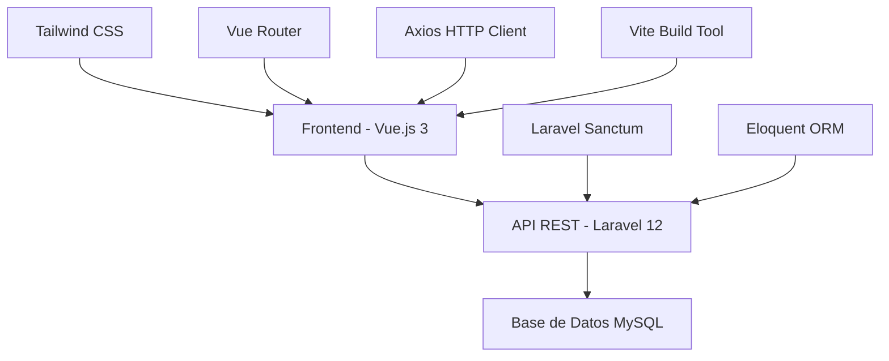
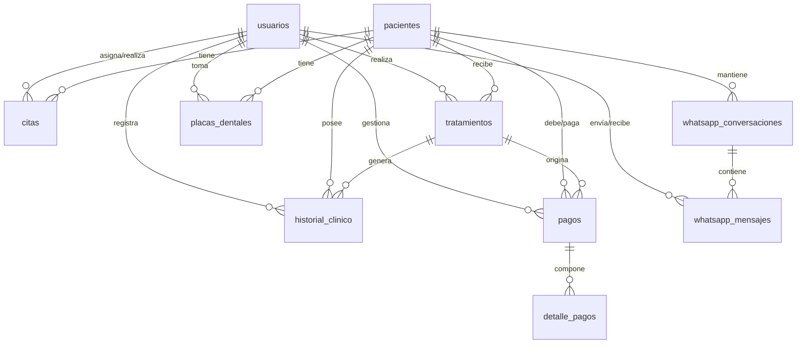
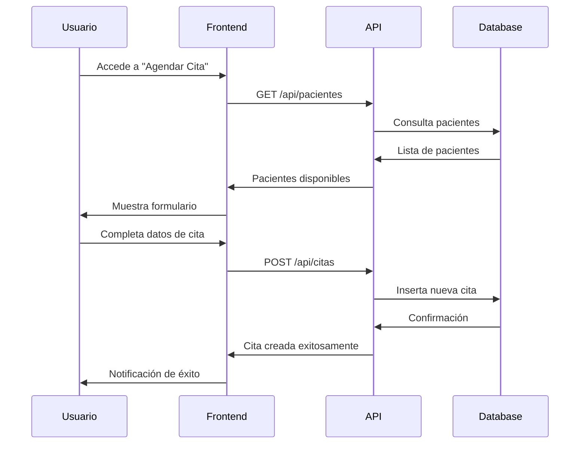
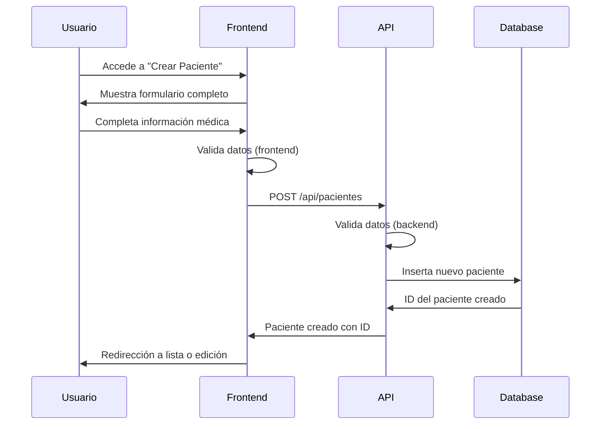
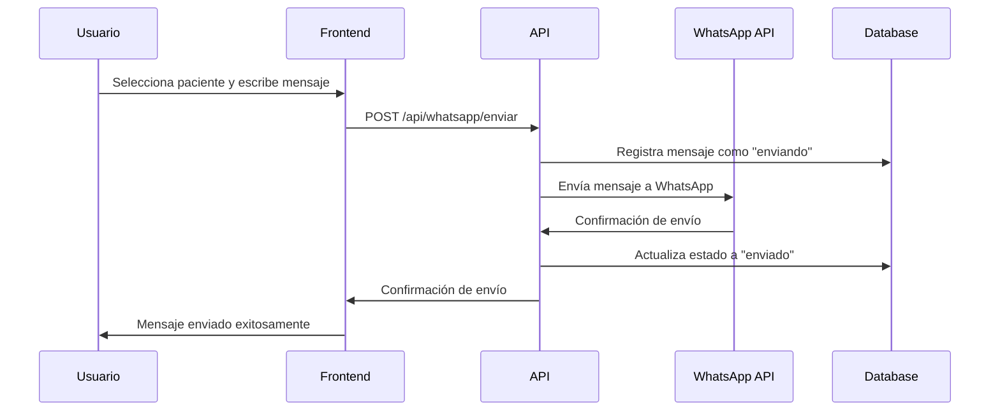
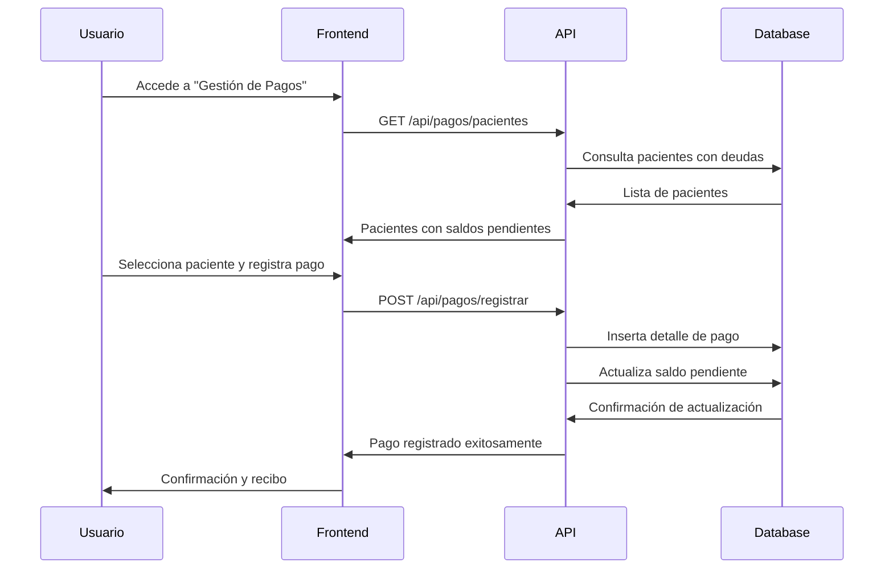

# 🦷 DOCUMENTACIÓN COMPLETA - SISTEMA DE GESTIÓN DENTAL PRO3R

## 📋 Información General del Sistema

| Propiedad | Valor |
|-----------|-------|
| **Nombre del Sistema** | Pro3r - Sistema de Gestión Dental |
| **Versión** | 1.0.0 |
| **Framework Backend** | Laravel 12.x |
| **Framework Frontend** | Vue.js 3 + Vue Router 4 |
| **Base de Datos** | MySQL/PostgreSQL |
| **Estilos** | Tailwind CSS 4.0 |
| **Autenticación** | Laravel Sanctum |
| **Servidor Web** | Apache/Nginx |
| **Gestor de Dependencias** | Composer (PHP) + NPM (Node.js) |

---

## 🏗️ ARQUITECTURA DEL SISTEMA

### Stack Tecnológico Completo



### Estructura de Directorios

```
Pro3r/
├── 📁 app/                          # Lógica del backend Laravel
│   ├── 📁 Http/Controllers/         # Controladores de la API
│   ├── 📁 Models/                   # Modelos Eloquent
│   └── 📁 Providers/               # Proveedores de servicios
├── 📁 database/                     # Base de datos
│   ├── 📁 migrations/              # Migraciones de BD
│   ├── 📁 seeders/                 # Datos iniciales
│   └── 📁 factories/               # Factories para testing
├── 📁 resources/                    # Recursos del frontend
│   ├── 📁 js/                      # Aplicación Vue.js
│   │   ├── 📁 components/          # Componentes Vue
│   │   ├── 📄 app.js               # Punto de entrada
│   │   └── 📄 router.js            # Configuración de rutas
│   ├── 📁 css/                     # Estilos CSS
│   └── 📁 views/                   # Plantillas Blade
├── 📁 routes/                       # Definición de rutas
│   ├── 📄 api.php                  # Rutas de la API
│   └── 📄 web.php                  # Rutas web
├── 📁 public/                       # Archivos públicos
├── 📄 composer.json                 # Dependencias PHP
└── 📄 package.json                  # Dependencias Node.js
```

---

## 🗄️ BASE DE DATOS - ESQUEMA COMPLETO

### Tablas Principales

#### 1. 👤 **usuarios**
```sql
CREATE TABLE usuarios (
    id BIGINT UNSIGNED PRIMARY KEY AUTO_INCREMENT,
    usuario VARCHAR(50) UNIQUE NOT NULL,        -- Nombre de usuario único
    nombre VARCHAR(255) NOT NULL,               -- Nombre completo
    rol ENUM('dentista', 'recepcionista') NOT NULL, -- Rol del usuario
    password_hash VARCHAR(255) NOT NULL,        -- Contraseña hasheada
    activo BOOLEAN DEFAULT true,                -- Estado activo/inactivo
    created_at TIMESTAMP DEFAULT CURRENT_TIMESTAMP,
    updated_at TIMESTAMP DEFAULT CURRENT_TIMESTAMP ON UPDATE CURRENT_TIMESTAMP
);
```

#### 2. 🏥 **pacientes**
```sql
CREATE TABLE pacientes (
    id BIGINT UNSIGNED PRIMARY KEY AUTO_INCREMENT,
    nombre_completo VARCHAR(255) NOT NULL,      -- Nombre completo del paciente
    telefono VARCHAR(20),                       -- Número de teléfono
    fecha_nacimiento DATE,                      -- Fecha de nacimiento
    ultima_visita DATE,                         -- Última visita registrada
    direccion TEXT,                             -- Dirección del paciente
    email VARCHAR(255),                         -- Correo electrónico
    contacto_emergencia VARCHAR(255),           -- Contacto de emergencia
    telefono_emergencia VARCHAR(20),            -- Teléfono de emergencia
    alergias TEXT,                              -- Alergias conocidas
    medicamentos_actuales TEXT,                 -- Medicamentos que toma
    enfermedades_previas TEXT,                  -- Historial de enfermedades
    notas_adicionales TEXT,                     -- Notas adicionales
    created_at TIMESTAMP DEFAULT CURRENT_TIMESTAMP,
    updated_at TIMESTAMP DEFAULT CURRENT_TIMESTAMP ON UPDATE CURRENT_TIMESTAMP
);
```

#### 3. 📅 **citas**
```sql
CREATE TABLE citas (
    id BIGINT UNSIGNED PRIMARY KEY AUTO_INCREMENT,
    paciente_id BIGINT UNSIGNED NOT NULL,      -- FK a pacientes
    fecha DATE NOT NULL,                        -- Fecha de la cita
    hora TIME NOT NULL,                         -- Hora de la cita
    tipo_cita VARCHAR(100) NOT NULL,           -- Tipo de cita (consulta, limpieza, etc.)
    estado ENUM('programada', 'completada', 'cancelada') DEFAULT 'programada',
    notas TEXT,                                 -- Notas de la cita
    dentista_id BIGINT UNSIGNED,               -- FK a usuarios (dentista)
    created_at TIMESTAMP DEFAULT CURRENT_TIMESTAMP,
    updated_at TIMESTAMP DEFAULT CURRENT_TIMESTAMP ON UPDATE CURRENT_TIMESTAMP,
    FOREIGN KEY (paciente_id) REFERENCES pacientes(id) ON DELETE CASCADE,
    FOREIGN KEY (dentista_id) REFERENCES usuarios(id) ON DELETE SET NULL
);
```

#### 4. 🦷 **tratamientos**
```sql
CREATE TABLE tratamientos (
    id BIGINT UNSIGNED PRIMARY KEY AUTO_INCREMENT,
    paciente_id BIGINT UNSIGNED NOT NULL,      -- FK a pacientes
    nombre VARCHAR(255) NOT NULL,               -- Nombre del tratamiento
    descripcion TEXT,                           -- Descripción detallada
    estado ENUM('planificado', 'en_progreso', 'completado', 'cancelado') DEFAULT 'planificado',
    fecha_inicio DATE,                          -- Fecha de inicio
    fecha_fin DATE,                             -- Fecha de finalización
    costo_total DECIMAL(10,2),                  -- Costo total del tratamiento
    dentista_id BIGINT UNSIGNED,               -- FK a usuarios (dentista)
    observaciones TEXT,                         -- Observaciones del dentista
    created_at TIMESTAMP DEFAULT CURRENT_TIMESTAMP,
    updated_at TIMESTAMP DEFAULT CURRENT_TIMESTAMP ON UPDATE CURRENT_TIMESTAMP,
    FOREIGN KEY (paciente_id) REFERENCES pacientes(id) ON DELETE CASCADE,
    FOREIGN KEY (dentista_id) REFERENCES usuarios(id) ON DELETE SET NULL
);
```

#### 5. 📄 **historial_clinico**
```sql
CREATE TABLE historial_clinico (
    id BIGINT UNSIGNED PRIMARY KEY AUTO_INCREMENT,
    paciente_id BIGINT UNSIGNED NOT NULL,      -- FK a pacientes
    tratamiento_id BIGINT UNSIGNED,            -- FK a tratamientos (opcional)
    fecha DATE NOT NULL,                        -- Fecha del registro
    tipo ENUM('consulta', 'procedimiento', 'seguimiento', 'observacion') NOT NULL,
    descripcion TEXT NOT NULL,                  -- Descripción del registro
    dentista_id BIGINT UNSIGNED,               -- FK a usuarios (dentista)
    archivos_adjuntos JSON,                     -- Archivos relacionados
    created_at TIMESTAMP DEFAULT CURRENT_TIMESTAMP,
    updated_at TIMESTAMP DEFAULT CURRENT_TIMESTAMP ON UPDATE CURRENT_TIMESTAMP,
    FOREIGN KEY (paciente_id) REFERENCES pacientes(id) ON DELETE CASCADE,
    FOREIGN KEY (tratamiento_id) REFERENCES tratamientos(id) ON DELETE SET NULL,
    FOREIGN KEY (dentista_id) REFERENCES usuarios(id) ON DELETE SET NULL
);
```

#### 6. 🏷️ **placas_dentales**
```sql
CREATE TABLE placas_dentales (
    id BIGINT UNSIGNED PRIMARY KEY AUTO_INCREMENT,
    paciente_id BIGINT UNSIGNED NOT NULL,      -- FK a pacientes
    nombre_archivo VARCHAR(255) NOT NULL,      -- Nombre del archivo de imagen
    ruta_archivo VARCHAR(500) NOT NULL,        -- Ruta del archivo
    tipo_placa VARCHAR(100),                    -- Tipo de radiografía
    fecha_toma DATE NOT NULL,                   -- Fecha de la radiografía
    descripcion TEXT,                           -- Descripción de la placa
    observaciones TEXT,                         -- Observaciones médicas
    dentista_id BIGINT UNSIGNED,               -- FK a usuarios (dentista)
    created_at TIMESTAMP DEFAULT CURRENT_TIMESTAMP,
    updated_at TIMESTAMP DEFAULT CURRENT_TIMESTAMP ON UPDATE CURRENT_TIMESTAMP,
    FOREIGN KEY (paciente_id) REFERENCES pacientes(id) ON DELETE CASCADE,
    FOREIGN KEY (dentista_id) REFERENCES usuarios(id) ON DELETE SET NULL
);
```

#### 7. 💰 **pagos**
```sql
CREATE TABLE pagos (
    id BIGINT UNSIGNED PRIMARY KEY AUTO_INCREMENT,
    paciente_id BIGINT UNSIGNED NOT NULL,      -- FK a pacientes
    tratamiento_id BIGINT UNSIGNED,            -- FK a tratamientos
    monto_total DECIMAL(10,2) NOT NULL,        -- Monto total del servicio
    monto_pagado DECIMAL(10,2) DEFAULT 0,      -- Monto ya pagado
    saldo_pendiente DECIMAL(10,2) NOT NULL,    -- Saldo pendiente
    metodo_pago ENUM('efectivo', 'tarjeta', 'transferencia', 'cuotas') NOT NULL,
    estado ENUM('pendiente', 'parcial', 'pagado', 'vencido') DEFAULT 'pendiente',
    fecha_vencimiento DATE,                     -- Fecha límite de pago
    descripcion TEXT,                           -- Descripción del pago
    recepcionista_id BIGINT UNSIGNED,          -- FK a usuarios (recepcionista)
    created_at TIMESTAMP DEFAULT CURRENT_TIMESTAMP,
    updated_at TIMESTAMP DEFAULT CURRENT_TIMESTAMP ON UPDATE CURRENT_TIMESTAMP,
    FOREIGN KEY (paciente_id) REFERENCES pacientes(id) ON DELETE CASCADE,
    FOREIGN KEY (tratamiento_id) REFERENCES tratamientos(id) ON DELETE SET NULL,
    FOREIGN KEY (recepcionista_id) REFERENCES usuarios(id) ON DELETE SET NULL
);
```

#### 8. 📋 **detalle_pagos**
```sql
CREATE TABLE detalle_pagos (
    id BIGINT UNSIGNED PRIMARY KEY AUTO_INCREMENT,
    pago_id BIGINT UNSIGNED NOT NULL,          -- FK a pagos
    fecha_pago DATE NOT NULL,                   -- Fecha del pago específico
    monto DECIMAL(10,2) NOT NULL,              -- Monto de este pago
    metodo_pago VARCHAR(50) NOT NULL,          -- Método usado en este pago
    numero_recibo VARCHAR(100),                -- Número de recibo
    observaciones TEXT,                         -- Observaciones del pago
    recepcionista_id BIGINT UNSIGNED,          -- FK a usuarios (recepcionista)
    created_at TIMESTAMP DEFAULT CURRENT_TIMESTAMP,
    updated_at TIMESTAMP DEFAULT CURRENT_TIMESTAMP ON UPDATE CURRENT_TIMESTAMP,
    FOREIGN KEY (pago_id) REFERENCES pagos(id) ON DELETE CASCADE,
    FOREIGN KEY (recepcionista_id) REFERENCES usuarios(id) ON DELETE SET NULL
);
```

#### 9. 📱 **whatsapp_conversaciones**
```sql
CREATE TABLE whatsapp_conversaciones (
    id BIGINT UNSIGNED PRIMARY KEY AUTO_INCREMENT,
    paciente_id BIGINT UNSIGNED NOT NULL,      -- FK a pacientes
    numero_telefono VARCHAR(20) NOT NULL,      -- Número de WhatsApp
    estado ENUM('activa', 'archivada', 'bloqueada') DEFAULT 'activa',
    ultima_actividad TIMESTAMP,                -- Última actividad en la conversación
    etiquetas JSON,                             -- Etiquetas de organización
    notas TEXT,                                 -- Notas sobre la conversación
    created_at TIMESTAMP DEFAULT CURRENT_TIMESTAMP,
    updated_at TIMESTAMP DEFAULT CURRENT_TIMESTAMP ON UPDATE CURRENT_TIMESTAMP,
    FOREIGN KEY (paciente_id) REFERENCES pacientes(id) ON DELETE CASCADE
);
```

#### 10. 💬 **whatsapp_mensajes**
```sql
CREATE TABLE whatsapp_mensajes (
    id BIGINT UNSIGNED PRIMARY KEY AUTO_INCREMENT,
    conversacion_id BIGINT UNSIGNED NOT NULL,  -- FK a whatsapp_conversaciones
    mensaje TEXT NOT NULL,                      -- Contenido del mensaje
    tipo ENUM('texto', 'imagen', 'documento', 'audio') DEFAULT 'texto',
    direccion ENUM('enviado', 'recibido') NOT NULL,
    estado ENUM('enviando', 'enviado', 'entregado', 'leido', 'error') DEFAULT 'enviando',
    timestamp_whatsapp TIMESTAMP,              -- Timestamp del mensaje en WhatsApp
    archivo_adjunto VARCHAR(500),              -- Ruta del archivo adjunto
    usuario_id BIGINT UNSIGNED,                -- FK a usuarios (quien envió/recibió)
    created_at TIMESTAMP DEFAULT CURRENT_TIMESTAMP,
    updated_at TIMESTAMP DEFAULT CURRENT_TIMESTAMP ON UPDATE CURRENT_TIMESTAMP,
    FOREIGN KEY (conversacion_id) REFERENCES whatsapp_conversaciones(id) ON DELETE CASCADE,
    FOREIGN KEY (usuario_id) REFERENCES usuarios(id) ON DELETE SET NULL
);
```

### Relaciones Entre Tablas



---

## 🔐 SISTEMA DE AUTENTICACIÓN

### Flujo de Autenticación

1. **Login del Usuario**
   ```javascript
   // Frontend: Login.vue
   async login() {
     const response = await axios.post('/api/login', {
       usuario: this.usuario,
       password: this.password
     });
     
     if (response.data.success) {
       sessionStorage.setItem('token', response.data.token);
       sessionStorage.setItem('user', JSON.stringify(response.data.user));
       this.$router.push('/citas/calendario');
     }
   }
   ```

2. **Backend: AuthController**
   ```php
   public function login(Request $request) {
       $credentials = $request->validate([
           'usuario' => 'required|string',
           'password' => 'required|string'
       ]);
       
       $user = Usuario::where('usuario', $credentials['usuario'])
                     ->where('activo', true)
                     ->first();
       
       if ($user && Hash::check($credentials['password'], $user->password_hash)) {
           $token = $user->createToken('API Token')->plainTextToken;
           
           return response()->json([
               'success' => true,
               'token' => $token,
               'user' => $user
           ]);
       }
       
       return response()->json(['success' => false], 401);
   }
   ```

### Roles y Permisos

#### 🩺 **Dentista**
- ✅ Acceso completo a todos los módulos
- ✅ Gestión de pacientes y tratamientos
- ✅ Acceso al historial clínico
- ✅ Gestión de placas dentales
- ✅ Visualización de pagos
- ✅ WhatsApp con pacientes

#### 🏢 **Recepcionista**
- ✅ Gestión de citas
- ✅ Gestión básica de pacientes
- ✅ Sistema completo de pagos
- ✅ WhatsApp con pacientes
- ❌ Acceso limitado a historial clínico
- ❌ No puede realizar diagnósticos

### Gestión de Sesiones

#### 🔒 **Política de Sesiones**
El sistema utiliza **sessionStorage** en lugar de localStorage para garantizar que:
- **🚪 Cierre automático**: Al cerrar la ventana/pestaña del navegador, la sesión se elimina automáticamente
- **🔐 Seguridad mejorada**: No persiste información sensible entre sesiones del navegador
- **👤 Re-autenticación**: El usuario debe iniciar sesión nuevamente cada vez que abre el navegador

#### 📝 **Implementación Técnica**
```javascript
// Guardar sesión (solo durante la sesión del navegador)
sessionStorage.setItem('usuario', JSON.stringify(userData));

// Verificar sesión activa
const usuario = sessionStorage.getItem('usuario');

// Eliminar sesión al cerrar sesión
sessionStorage.removeItem('usuario');
```

#### ⚡ **Ventajas del Sistema**
- **Seguridad**: Datos sensibles no persisten en el disco
- **Privacidad**: Ideal para computadoras compartidas
- **Control**: Sesiones se cierran automáticamente
- **Cumplimiento**: Mejor para estándares de seguridad médica

---

## 🎯 MÓDULOS DEL SISTEMA

### 1. 📅 **MÓDULO DE CITAS**

#### Funcionalidades
- **Ver Calendario**: Vista mensual con todas las citas
- **Agendar Citas**: Formulario para crear nuevas citas
- **Gestionar Citas**: Editar, cancelar, completar citas

#### Componentes Frontend
```javascript
// CitasCalendario.vue - Vista de calendario principal
// CitasAgendar.vue - Formulario para nuevas citas
```

#### API Endpoints
```php
GET    /api/citas          // Obtener todas las citas
POST   /api/citas          // Crear nueva cita
PUT    /api/citas/{id}     // Actualizar cita
DELETE /api/citas/{id}     // Eliminar cita
```

#### Flujo de Trabajo
1. **Visualización**: Calendario muestra citas del mes
2. **Creación**: Formulario valida datos y crea cita
3. **Notificación**: Sistema confirma creación
4. **Actualización**: Calendario se actualiza automáticamente

### 2. 🏥 **MÓDULO DE PACIENTES**

#### Funcionalidades
- **Ver Pacientes**: Lista completa con filtros
- **Crear Paciente**: Formulario con datos médicos
- **Editar Paciente**: Actualización de información

#### Componentes Frontend
```javascript
// PacienteVer.vue - Lista de pacientes
// PacienteCrear.vue - Formulario de creación
// PacienteEditar.vue - Formulario de edición
```

#### Campos del Formulario
- **Datos Básicos**: Nombre, teléfono, fecha nacimiento
- **Contacto**: Dirección, email, contacto emergencia
- **Médicos**: Alergias, medicamentos, enfermedades previas
- **Notas**: Observaciones adicionales

### 3. 🦷 **MÓDULO DE TRATAMIENTOS**

#### Funcionalidades
- **Registrar Tratamiento**: Nuevo plan de tratamiento
- **Ver Tratamientos**: Lista por paciente
- **Seguimiento**: Agregar observaciones y finalizar

#### Estados de Tratamiento
- 🔵 **Planificado**: Tratamiento programado
- 🟡 **En Progreso**: Tratamiento activo
- ✅ **Completado**: Tratamiento finalizado
- ❌ **Cancelado**: Tratamiento cancelado

### 4. 📱 **MÓDULO DE WHATSAPP**

#### Funcionalidades Principales
- **Bandeja de Entrada**: Conversaciones activas
- **Envío de Mensajes**: Comunicación directa
- **Plantillas**: Mensajes predefinidos
- **Automatizaciones**: Recordatorios automáticos
- **Programación**: Envíos programados

#### Componentes Frontend
```javascript
// WhatsappBandeja.vue - Lista de conversaciones
// WhatsappConversacion.vue - Chat individual
// WhatsappPlantillas.vue - Gestión de plantillas
// WhatsappAutomatizaciones.vue - Configuración de automatizaciones
```

#### Casos de Uso
1. **Recordatorio de Citas**: Mensaje automático 24h antes
2. **Confirmación**: Confirmación de citas agendadas
3. **Seguimiento**: Mensajes post-tratamiento
4. **Promociones**: Ofertas especiales
5. **Emergencias**: Comunicación urgente

### 5. 📸 **MÓDULO DE PLACAS DENTALES**

#### Funcionalidades
- **Subir Placas**: Upload de imágenes radiográficas
- **Ver Placas**: Galería por paciente
- **Gestionar Placas**: Editar información y eliminar

#### Tipos de Placas Soportadas
- 🦷 **Periapical**: Dientes individuales
- 📸 **Panorámica**: Vista completa de la boca
- 🔍 **Bite-wing**: Zona posterior
- 📷 **Oclusal**: Vista desde arriba/abajo

#### Componentes Frontend
```javascript
// PlacaSubir.vue - Upload de imágenes
// PlacaVer.vue - Galería de placas
// PlacaEliminar.vue - Gestión de eliminación
```

### 6. 💰 **MÓDULO DE PAGOS**

#### Funcionalidades Completas
- **Gestión de Pagos**: CRUD completo
- **Métodos de Pago**: Efectivo, tarjeta, transferencia, cuotas
- **Estados**: Pendiente, parcial, pagado, vencido
- **Reportes**: Resúmenes y estadísticas
- **Cuotas**: Sistema de pagos fraccionados

#### Componentes Frontend
```javascript
// GestionPagos.vue - Interfaz principal de pagos
```

#### API Endpoints
```php
GET  /api/pagos/pacientes        // Lista de pacientes con deudas
GET  /api/pagos/resumen          // Resumen financiero
POST /api/pagos/registrar        // Registrar nuevo pago
GET  /api/pagos/paciente/{id}    // Pagos de un paciente
POST /api/pagos/cuota            // Registrar pago de cuota
```

### 7. 👥 **MÓDULO DE USUARIOS**

#### Funcionalidades
- **Ver Usuarios**: Lista con filtros y estadísticas
- **Editar Usuarios**: Selección y edición individual
- **Crear Usuarios**: Formulario con validaciones

#### Características del Sistema
- **Roles**: Dentista y Recepcionista
- **Estados**: Activo/Inactivo
- **Seguridad**: Validación de contraseñas fuertes
- **Gestión**: CRUD completo con permisos

#### Componentes Frontend
```javascript
// UsuariosVer.vue - Lista y gestión básica
// UsuariosEditarLista.vue - Selección para editar
// UsuariosEditar.vue - Formulario de edición individual
// UsuariosCrear.vue - Formulario de creación
```

---

## 🔄 FLUJOS DE TRABAJO PRINCIPALES

### Flujo 1: 📅 **Agendar Nueva Cita**


### Flujo 2: 🏥 **Crear Nuevo Paciente**


### Flujo 3: 📱 **Envío de Mensaje WhatsApp**


### Flujo 4: 💰 **Registro de Pago**


---

## 🎨 INTERFAZ DE USUARIO

### Diseño Visual
- **Framework**: Tailwind CSS 4.0
- **Colores Principales**: 
  - Primario: `#a259ff` (Morado)
  - Secundario: `#6366f1` (Índigo)
  - Éxito: `#10b981` (Verde)
  - Error: `#ef4444` (Rojo)
  - Advertencia: `#f59e0b` (Amarillo)

### Componentes de UI
- **Iconos**: BoxIcons (bx)
- **Formularios**: Tailwind con validación visual
- **Modales**: Overlays con backdrop
- **Notificaciones**: Toast notifications
- **Tablas**: Responsive con filtros
- **Calendarios**: Vue-cal para vista de citas

### Responsive Design
- **Mobile First**: Diseño optimizado para móviles
- **Breakpoints**: sm(640px), md(768px), lg(1024px), xl(1280px)
- **Grid System**: CSS Grid y Flexbox
- **Touch Friendly**: Botones y elementos táctiles optimizados

---

## 🚀 CONFIGURACIÓN Y DESPLIEGUE

### Requisitos del Sistema
- **PHP**: >= 8.2
- **Node.js**: >= 18.x
- **MySQL/PostgreSQL**: >= 8.0 / >= 13
- **Composer**: >= 2.0
- **NPM**: >= 9.x

### Instalación Paso a Paso

1. **Clonar Repositorio**
   ```bash
   git clone <repository-url> Pro3r
   cd Pro3r
   ```

2. **Instalar Dependencias PHP**
   ```bash
   composer install
   ```

3. **Instalar Dependencias Node.js**
   ```bash
   npm install
   ```

4. **Configurar Entorno**
   ```bash
   cp .env.example .env
   php artisan key:generate
   ```

5. **Configurar Base de Datos**
   ```env
   DB_CONNECTION=mysql
   DB_HOST=127.0.0.1
   DB_PORT=3306
   DB_DATABASE=pro3r_dental
   DB_USERNAME=root
   DB_PASSWORD=
   ```

6. **Ejecutar Migraciones**
   ```bash
   php artisan migrate
   ```

7. **Ejecutar Seeders**
   ```bash
   php artisan db:seed
   ```

8. **Compilar Assets**
   ```bash
   npm run build
   ```

9. **Iniciar Servidor**
   ```bash
   php artisan serve
   npm run dev
   ```

### Variables de Entorno Importantes
```env
# Aplicación
APP_NAME="Pro3r Dental"
APP_ENV=production
APP_DEBUG=false
APP_URL=https://tu-dominio.com

# Base de Datos
DB_CONNECTION=mysql
DB_HOST=localhost
DB_DATABASE=pro3r_dental

# WhatsApp (opcional)
WHATSAPP_API_TOKEN=
WHATSAPP_WEBHOOK_VERIFY_TOKEN=

# Almacenamiento de Archivos
FILESYSTEM_DISK=public
```

---

## 🧪 TESTING Y CALIDAD

### Estrategias de Testing
- **Unit Tests**: PHPUnit para lógica de negocio
- **Feature Tests**: Tests de endpoints API
- **Frontend Tests**: Vue Test Utils
- **Integration Tests**: Base de datos completa

### Comandos de Testing
```bash
# Ejecutar todos los tests
php artisan test

# Tests específicos
php artisan test --filter=PacienteTest

# Coverage report
php artisan test --coverage
```

---

## 📊 MONITOREO Y LOGS

### Sistema de Logs
- **Laravel Log**: `storage/logs/laravel.log`
- **API Requests**: Middleware de logging
- **Error Tracking**: Integración con Sentry (opcional)
- **Performance**: Query debugging habilitado

### Métricas Importantes
- **Tiempo de Respuesta**: < 200ms promedio
- **Uptime**: > 99.9%
- **Usuarios Concurrentes**: Hasta 50 usuarios
- **Almacenamiento**: Crecimiento de ~100MB/mes

---

## 🔒 SEGURIDAD

### Medidas Implementadas
- **CSRF Protection**: Tokens en formularios
- **SQL Injection**: Prepared statements (Eloquent)
- **XSS Protection**: Escape de datos en templates
- **Password Hashing**: Bcrypt con salt
- **Rate Limiting**: API throttling
- **File Upload**: Validación de tipos y tamaños

### Políticas de Seguridad
- **Contraseñas**: Mínimo 6 caracteres, validación de fortaleza
- **Sesiones**: Expiración automática
- **Backup**: Respaldos automáticos diarios
- **Updates**: Actualizaciones de seguridad mensuales

---

## 📈 RENDIMIENTO

### Optimizaciones Implementadas
- **Database Indexing**: Índices en campos frecuentes
- **Query Optimization**: Eager loading, N+1 prevention
- **Asset Optimization**: Vite bundling y minificación
- **Caching**: Redis para sesiones y cache
- **CDN**: Archivos estáticos via CDN

### Métricas de Performance
- **First Contentful Paint**: < 1.5s
- **Time to Interactive**: < 3s
- **Database Queries**: < 50ms promedio
- **Bundle Size**: < 500KB (gzipped)

---

## 🚨 MANTENIMIENTO

### Tareas Regulares
- **Backup Diario**: Base de datos y archivos
- **Limpieza de Logs**: Rotación semanal
- **Updates**: Revisión mensual de dependencias
- **Monitoring**: Revisión diaria de métricas

### Procedimientos de Emergencia
- **Rollback**: Scripts de reversión automática
- **Disaster Recovery**: Plan de recuperación 4h
- **Escalation**: Contactos de soporte técnico

---

## 📋 ROADMAP FUTURO

### Próximas Funcionalidades
- 📧 **Sistema de Email**: Integración con SMTP
- 📊 **Reportes Avanzados**: Dashboard analítico
- 🔔 **Notificaciones Push**: Alertas en tiempo real
- 💳 **Pasarela de Pagos**: Integración con Stripe/PayPal
- 📱 **App Móvil**: React Native companion
- 🤖 **IA Diagnóstica**: Asistente de diagnóstico
- 🌐 **Multi-idioma**: Soporte i18n
- ☁️ **Cloud Sync**: Sincronización en la nube

### Mejoras Técnicas
- **API v2**: GraphQL endpoints
- **Microservicios**: Separación de servicios
- **Containerización**: Docker deployment
- **CI/CD**: Pipelines automáticos
- **Monitoring**: Prometheus + Grafana

---

**📝 Documentación generada el 27 de julio de 2025**  
**🔧 Sistema: Pro3r Dental Management v1.0.0**  
**👨‍💻 Mantenido por: Equipo de Desarrollo Pro3r**
