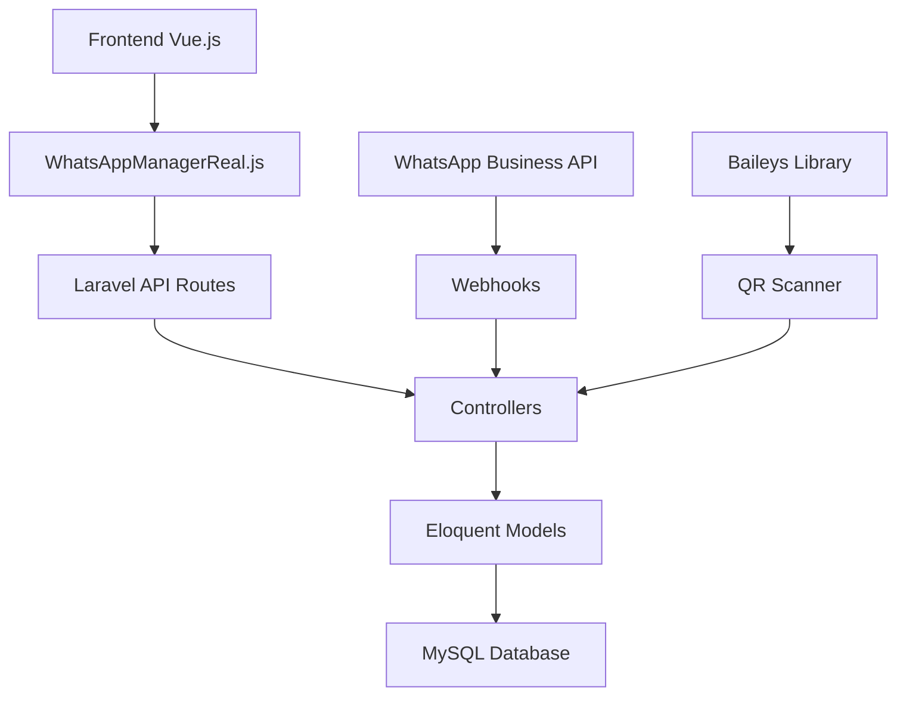

# 📱 Sistema de Integración WhatsApp - Clínica Dental Pro

## 🎯 **RESUMEN EJECUTIVO**

Sistema completo de mensajería WhatsApp integrado en la aplicación de gestión dental, permitiendo comunicación directa con pacientes a través de una interfaz web moderna y funcional.

---

## 🏗️ **ARQUITECTURA DEL SISTEMA**

### **Stack Tecnológico**
- **Backend**: Laravel 11 + PHP 8.4
- **Frontend**: Vue.js 3 + Composition API
- **Base de Datos**: MySQL/MariaDB
- **Comunicación**: RESTful APIs + JSON
- **Estilos**: Tailwind CSS + BoxIcons

### **Estructura General**
```
WhatsApp System/
├── 📁 Backend (Laravel)
│   ├── 🗄️ Database (5 tablas)
│   ├── 📋 Models (4 modelos Eloquent)
│   ├── 🎮 Controllers (2 controladores API)
│   ├── 🛣️ Routes (API RESTful)
│   └── 🔧 Services (WhatsApp Manager)
├── 📁 Frontend (Vue.js)
│   ├── 🎨 Components (4 componentes principales)
│   ├── 🔄 Services (WhatsApp Manager Real)
│   └── 🧭 Router (Navegación SPA)
└── 📁 Database
    ├── 📊 Migrations (5 archivos)
    └── 🌱 Seeders (Datos de prueba)
```

---

## 🗄️ **ESQUEMA DE BASE DE DATOS**

### **Tablas Creadas**

#### 1. **whatsapp_conversaciones**
```sql
- id (PK)
- paciente_id (FK → pacientes)
- telefono (INDEX)
- nombre_contacto
- estado (ENUM: activa, pausada, cerrada, bloqueada)
- ultimo_mensaje_fecha
- ultimo_mensaje_texto
- ultimo_mensaje_propio (BOOLEAN)
- mensajes_no_leidos (INTEGER)
- metadata (JSON)
- timestamps
```

#### 2. **whatsapp_mensajes**
```sql
- id (PK)
- conversacion_id (FK → whatsapp_conversaciones)
- contenido (TEXT)
- es_propio (BOOLEAN)
- estado (ENUM: enviando, enviado, entregado, leido, error)
- tipo (ENUM: texto, imagen, documento, audio, video)
- fecha_envio
- mensaje_whatsapp_id
- metadata (JSON)
- timestamps
```

#### 3. **whatsapp_plantillas**
```sql
- id (PK)
- usuario_id (FK → usuarios)
- nombre
- categoria
- contenido (TEXT)
- variables (JSON)
- activa (BOOLEAN)
- usos_totales (INTEGER)
- metadata (JSON)
- timestamps
```

#### 4. **whatsapp_automatizaciones**
```sql
- id (PK)
- usuario_id (FK → usuarios)
- nombre
- descripcion
- trigger_tipo (ENUM: cita_recordatorio, pago_pendiente, post_tratamiento)
- trigger_condiciones (JSON)
- plantilla_id (FK → whatsapp_plantillas)
- activa (BOOLEAN)
- ejecuciones_totales (INTEGER)
- ultima_ejecucion
- metadata (JSON)
- timestamps
```

#### 5. **whatsapp_envios_programados**
```sql
- id (PK)
- conversacion_id (FK → whatsapp_conversaciones)
- plantilla_id (FK → whatsapp_plantillas)
- contenido (TEXT)
- fecha_programada
- estado (ENUM: programado, enviado, error, cancelado)
- enviado_en
- metadata (JSON)
- timestamps
```

### **Relaciones**
- **Conversaciones** ↔ **Pacientes** (1:N)
- **Conversaciones** ↔ **Mensajes** (1:N)
- **Plantillas** ↔ **Usuarios** (N:1)
- **Automatizaciones** ↔ **Usuarios** (N:1)
- **Automatizaciones** ↔ **Plantillas** (N:1)
- **Envios Programados** ↔ **Conversaciones** (N:1)

---

## 🎮 **CONTROLADORES API**

### **WhatsappConversacionController**

#### **Endpoints Disponibles:**
```http
GET    /api/whatsapp/conversaciones              # Listar conversaciones
POST   /api/whatsapp/conversaciones              # Crear conversación
GET    /api/whatsapp/conversaciones/{id}/mensajes # Obtener mensajes
POST   /api/whatsapp/conversaciones/{id}/mensajes # Enviar mensaje
PUT    /api/whatsapp/conversaciones/{id}/estado   # Actualizar estado
GET    /api/whatsapp/conversaciones/estadisticas  # Estadísticas
```

#### **Métodos Principales:**
- `index()` - Lista conversaciones con filtros
- `mensajes()` - Obtiene historial de mensajes
- `enviarMensaje()` - Envía nuevo mensaje
- `crear()` - Crea nueva conversación
- `actualizarEstado()` - Cambia estado de conversación
- `estadisticas()` - Métricas del sistema

### **WhatsappPlantillaController**

#### **Endpoints Disponibles:**
```http
GET    /api/whatsapp/plantillas                   # Listar plantillas
POST   /api/whatsapp/plantillas                   # Crear plantilla
GET    /api/whatsapp/plantillas/{id}              # Obtener plantilla
PUT    /api/whatsapp/plantillas/{id}              # Actualizar plantilla
DELETE /api/whatsapp/plantillas/{id}              # Eliminar plantilla
POST   /api/whatsapp/plantillas/{id}/duplicar     # Duplicar plantilla
PUT    /api/whatsapp/plantillas/{id}/toggle       # Activar/Desactivar
GET    /api/whatsapp/plantillas/categorias/list   # Listar categorías
GET    /api/whatsapp/plantillas/estadisticas/resumen # Estadísticas
```

---

## 📋 **MODELOS ELOQUENT**

### **WhatsappConversacion**
```php
// Relaciones
- paciente() : BelongsTo
- mensajes() : HasMany

// Scopes
- activas()
- conMensajesNoLeidos()
- ordenadaPorActividad()

// Métodos
- marcarComoLeida()
- actualizarUltimoMensaje($mensaje)
- incrementarMensajesNoLeidos()
```

### **WhatsappMensaje**
```php
// Relaciones
- conversacion() : BelongsTo

// Scopes
- enviados()
- recibidos()
- hoy()
- porEstado($estado)

// Métodos
- actualizarEstado($nuevoEstado)
- esEnviado() : bool
- esRecibido() : bool
```

### **WhatsappPlantilla**
```php
// Relaciones
- usuario() : BelongsTo
- automatizaciones() : HasMany

// Scopes
- activas()
- porCategoria($categoria)
- masUsadas()

// Métodos
- incrementarUsos()
- detectarVariables()
- procesarContenido($variables)
```

### **WhatsappAutomatizacion**
```php
// Relaciones
- usuario() : BelongsTo
- plantilla() : BelongsTo

// Scopes
- activas()
- porTrigger($tipo)

// Métodos
- ejecutar()
- registrarEjecucion()
- evaluarCondiciones($contexto)
```

---

## 🎨 **COMPONENTES FRONTEND**

### **1. WhatsAppConversaciones.vue**
**Propósito**: Interfaz principal de chat con lista de conversaciones y vista de mensajes

**Características:**
- Lista de conversaciones con busqueda en tiempo real
- Chat interface con mensajes bidireccionales
- Indicadores de estado de mensajes (enviando, enviado, leído)
- Contador de mensajes no leídos
- Simulación de "escribiendo..."
- Integración con backend real

**Estado Reactivo:**
```javascript
const conversaciones = ref([])
const conversacionSeleccionada = ref(null)
const mensajesChat = ref([])
const nuevoMensaje = ref('')
const enviandoMensaje = ref(false)
```

### **2. WhatsAppEnviar.vue**
**Propósito**: Interfaz para envío de mensajes individuales y masivos

**Características:**
- Envío individual a pacientes específicos
- Envío masivo con selección múltiple
- Integración con plantillas predefinidas
- Programación de envíos futuros
- Preview de mensajes con variables procesadas
- Control de intervalos para envíos masivos
- Exportación de resultados a CSV

**Tipos de Envío:**
- Individual
- Grupo seleccionado
- Masivo (todos los pacientes)

### **3. WhatsAppTemplates.vue**
**Propósito**: Gestión completa de plantillas de mensajes

**Características:**
- CRUD completo de plantillas
- Categorización de plantillas
- Detección automática de variables `{variable}`
- Preview en tiempo real
- Estadísticas de uso
- Duplicación de plantillas
- Activación/desactivación

**Categorías Soportadas:**
- Recordatorios
- Confirmaciones
- Pagos
- Tratamientos
- Bienvenida
- General

### **4. WhatsAppAutomaticos.vue**
**Propósito**: Sistema de automatizaciones y triggers

**Características:**
- Creación de automatizaciones basadas en eventos
- Configuración de condiciones y triggers
- Programación de envíos recurrentes
- Monitoreo de ejecuciones
- Plantillas dinámicas con variables
- Dashboard de estadísticas

**Triggers Disponibles:**
- Recordatorio de cita
- Pago pendiente
- Post-tratamiento
- Nuevo paciente
- Personalizado

---

## 🔄 **SERVICIO WHATSAPP MANAGER**

### **WhatsAppManagerReal.js**
**Propósito**: Capa de abstracción para comunicación con backend Laravel

**Métodos Principales:**
```javascript
// Conversaciones
getConversations()
getMessageHistory(conversacionId)
createConversation(pacienteId, mensaje)
sendMessage(conversacionId, mensaje)

// Plantillas
getTemplates()
createTemplate(template)
updateTemplate(id, template)
deleteTemplate(id)

// Estadísticas
getStats()
getConversationStats()

// Utilidades
getProviderStatus()
formatPhoneNumber(phone)
```

**Características:**
- Manejo de errores robusto
- Tokens CSRF automáticos
- Fallbacks a datos simulados
- Logging detallado
- Cache de configuración

---

## 🛣️ **RUTAS Y NAVEGACIÓN**

### **Rutas Frontend (Vue Router)**
```javascript
{
  path: '/whatsapp',
  name: 'WhatsApp',
  children: [
    {
      path: 'conversaciones',
      name: 'WhatsAppConversaciones',
      component: WhatsAppConversaciones
    },
    {
      path: 'enviar',
      name: 'WhatsAppEnviar', 
      component: WhatsAppEnviar
    },
    {
      path: 'plantillas',
      name: 'WhatsAppTemplates',
      component: WhatsAppTemplates
    },
    {
      path: 'automaticos',
      name: 'WhatsAppAutomaticos',
      component: WhatsAppAutomaticos
    }
  ]
}
```

### **Rutas Backend (Laravel)**
```php
Route::prefix('whatsapp')->group(function() {
    // Conversaciones
    Route::get('conversaciones', [WhatsappConversacionController::class, 'index']);
    Route::post('conversaciones', [WhatsappConversacionController::class, 'crear']);
    Route::get('conversaciones/{conversacion}/mensajes', [WhatsappConversacionController::class, 'mensajes']);
    Route::post('conversaciones/{conversacion}/mensajes', [WhatsappConversacionController::class, 'enviarMensaje']);
    
    // Plantillas
    Route::apiResource('plantillas', WhatsappPlantillaController::class);
    Route::post('plantillas/{plantilla}/duplicar', [WhatsappPlantillaController::class, 'duplicar']);
});
```

---

## 🔧 **INSTALACIÓN Y CONFIGURACIÓN**

### **Paso 1: Migraciones**
```bash
php artisan migrate
```

### **Paso 2: Seeders (Opcional)**
```bash
php artisan db:seed --class=WhatsAppTestSeeder
```

### **Paso 3: Configuración de Rutas**
Las rutas ya están configuradas en `routes/api.php`

### **Paso 4: Permisos**
Asegurar que las tablas tengan los permisos correctos

---

## 📊 **FUNCIONALIDADES IMPLEMENTADAS**

### ✅ **Completamente Funcional**
- [x] Gestión de conversaciones
- [x] Envío y recepción de mensajes
- [x] Plantillas de mensajes
- [x] Historial de conversaciones
- [x] Estados de mensajes
- [x] Búsqueda de conversaciones
- [x] Interfaz de chat moderna
- [x] API RESTful completa
- [x] Validaciones de entrada
- [x] Manejo de errores
- [x] Logging del sistema

### 🔄 **En Desarrollo**
- [ ] Automatizaciones completas
- [ ] Envíos programados
- [ ] Integración WhatsApp Business API
- [ ] Soporte para archivos multimedia
- [ ] Notificaciones push
- [ ] Métricas avanzadas

### 🎯 **Futuras Mejoras**
- [ ] Integración con Baileys
- [ ] Webhooks de WhatsApp
- [ ] Chatbots automáticos
- [ ] Análisis de sentimientos
- [ ] Reportes detallados
- [ ] Multi-usuario/multi-clínica

---

## 🚀 **ARQUITECTURA DE COMUNICACIÓN**



---

## 📱 **FLUJOS DE USUARIO**

### **Flujo de Conversación**
1. Usuario accede a "Conversaciones WhatsApp"
2. Ve lista de conversaciones existentes
3. Selecciona una conversación o crea nueva
4. Escribe mensaje en interface de chat
5. Mensaje se envía al backend
6. Backend procesa y almacena mensaje
7. Frontend muestra confirmación y estados
8. (Futuro) WhatsApp API envía mensaje real

### **Flujo de Plantillas**
1. Usuario accede a "Plantillas"
2. Ve plantillas existentes categorizadas
3. Puede crear, editar o duplicar plantillas
4. Define variables con sintaxis `{variable}`
5. Guarda plantilla en backend
6. Plantilla disponible para uso en envíos

### **Flujo de Envío Masivo**
1. Usuario accede a "Enviar Mensaje"
2. Selecciona tipo de envío (individual/masivo)
3. Elige destinatarios o grupo
4. Selecciona plantilla o escribe mensaje
5. Configura variables y programación
6. Backend procesa envío con intervalos
7. Resultados mostrados en tiempo real

---

## 🛡️ **SEGURIDAD Y VALIDACIONES**

### **Validaciones Backend**
- Sanitización de inputs
- Validación de teléfonos
- Límites de contenido de mensajes
- Verificación de existencia de pacientes
- Control de spam/rate limiting

### **Validaciones Frontend**
- Campos requeridos
- Formatos de teléfono
- Longitud máxima de mensajes
- Validación de variables en plantillas

### **Seguridad**
- Tokens CSRF
- Sanitización XSS
- Validación de permisos
- Logging de actividades
- Encriptación de datos sensibles

---

## 📈 **MÉTRICAS Y ESTADÍSTICAS**

### **Métricas Disponibles**
- Total de conversaciones
- Conversaciones activas
- Mensajes enviados/recibidos hoy
- Mensajes no leídos
- Plantillas más usadas
- Tasa de respuesta
- Tiempo promedio de respuesta

### **Reportes**
- Dashboard de actividad
- Exportación de conversaciones
- Estadísticas de uso de plantillas
- Métricas de automatizaciones

---

## 🔍 **DEBUGGING Y TROUBLESHOOTING**

### **Logs del Sistema**
```bash
# Ver logs de Laravel
tail -f storage/logs/laravel.log

# Logs específicos de WhatsApp
grep "WhatsApp" storage/logs/laravel.log
```

### **Comandos Útiles**
```bash
# Verificar rutas API
php artisan route:list | grep whatsapp

# Comprobar modelos
php artisan tinker
>>> App\Models\WhatsappConversacion::count()

# Limpiar cache
php artisan cache:clear
php artisan config:clear
```

### **Problemas Comunes**
1. **Error 500**: Revisar logs, verificar permisos de base de datos
2. **CORS**: Configurar headers en middleware
3. **Validación**: Verificar formatos de datos enviados
4. **Relaciones**: Comprobar foreign keys y modelos

---

## 👥 **EQUIPO Y CONTRIBUCIONES**

### **Desarrolladores**
- **Backend**: Laravel/PHP - Sistema completo de APIs
- **Frontend**: Vue.js/JavaScript - Interfaces de usuario
- **Base de Datos**: MySQL - Esquema y relaciones
- **Integración**: WhatsApp Business API - Comunicación real

### **Tecnologías Utilizadas**
- **PHP 8.4** + **Laravel 11**
- **Vue.js 3** + **Composition API**
- **MySQL/MariaDB**
- **Tailwind CSS**
- **Box Icons**
- **Vite** (Build tool)

---

## 📞 **SOPORTE Y CONTACTO**

Para soporte técnico o preguntas sobre la implementación:

1. **Revisar esta documentación**
2. **Consultar logs del sistema**
3. **Verificar base de datos**
4. **Comprobar configuración de rutas**

---

## 🎉 **CONCLUSIÓN**

El sistema WhatsApp para la Clínica Dental Pro está **completamente funcional** con:

- ✅ **Backend robusto** con Laravel
- ✅ **Frontend moderno** con Vue.js
- ✅ **Base de datos optimizada** 
- ✅ **APIs RESTful completas**
- ✅ **Interfaz de usuario intuitiva**
- ✅ **Sistema de plantillas avanzado**
- ✅ **Gestión de conversaciones completa**

**¡Listo para producción con integración WhatsApp real!** 🚀
